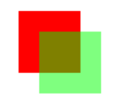
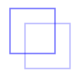

# Canvas

## 起步

1. 准备`<canvas>`块

在`<canvas>`标签中，必须先指定width和height属性，指定可以绘图的区域大小；标签中的内容是当浏览器不支持canvas时显示的信息

```html
<canvas id="can1" width="200" height="200">canvas</canvas>
```

2. 获取`<canvas>`元素，获取getContext对象

要在这块canvas上画图，就需要先取得这块画布的引用，检测它的getContext()方法是否存在。如果存在，创建该getContext对象

```javascript
let can1=document.getElementById("can1");
if(can1.getContext){//确定浏览器支持<canvas>元素
    let context=can1.getContext("2d");
}
```

## 2D上下文

1. 2D上下文的坐标开始于`<canvas>`元素的左上角，原点是(0,0)
2. x越大越靠右，y越大越靠下；width和height分别表示水平和垂直可以用的像素数

### 填充和描边

对context设置fillStyle和strokeStyle的颜色值

```javascript
let can1=document.getElementById("can1");
if(can1.getContext){
    let context=can1.getContext("2d");;
    context.strokeStyle="blue";
    context.fillStyle="#ff0000";
}
```


### 绘制矩形

+ `fillRect(x1,y1,width,height)`可以在以(x1,y1)为左上角画一个width*height的填充矩形，颜色由fillStyle决定

```javascript
let can1=document.getElementById("can1");
if(can1.getContext){
    let context=can1.getContext("2d");;
    
    context.fillStyle="#ff0000";
    context.fillRect(10,10,60,60);

    context.fillStyle="rgba(0,255,0,0.5)";
    context.fillRect(30,30,60,60);
}
```

结果：



+ `strokeRect(x1,y1,width,height)`可以在以(x1,y1)为左上角画一个width*height的描边矩形，颜色由strokeStyle决定

```javascript
let can1=document.getElementById("can1");
if(can1.getContext){
    let context=can1.getContext("2d");;
    
    context.strokeStyle="blue";
    context.strokeRect(10,10,60,60);

    context.strokeStyle="rgba(0,0,255,0.5)";
    context.strokeRect(30,30,60,60);
}
```

结果：



+ `clearRect(x1,y1,width,height)`可以在该指定矩形区域擦除所有画好的图形

```javascript
let can1=document.getElementById("can1");
if(can1.getContext){
    let context=can1.getContext("2d");;
    
    context.fillStyle="#ff0000";
    context.fillRect(10,10,60,60);

    context.fillStyle="rgba(0,255,0,0.5)";
    context.fillRect(30,30,60,60);
    context.clearRect(30,30,40,40);
}
```

结果：

