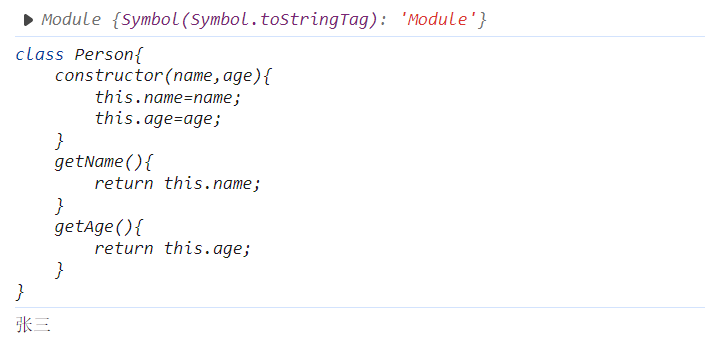

# JavaScript基础

## 声明变量

### var和let

+ var

1. var声明函数作用域（函数内局部变量，结束调用时销毁），let声明块级作用域（花括号之间）
2. var声明提升（自动声明在函数开始调用的部分），let无声明提升

```javascript
console.log(a);//打印undefined
var a=2;

/*等价于:
var a;
console.log(a);
a = 2;
*/
/*如果是:
console.log(a);
let a=2;
会报错
*/
```

同样地，

```javascript
console.log(a);
if(exp){
    let a=2;
}
console.log(a);//会报错
```

```javascript
console.log(a);
if(exp){
    var a=2;
}//会打印undefined，因var会提到函数开始的部分
```


3. 作用域（一个函数内）可以多次var同一个变量名，let不行

```javascript
var a=10;
var a=20;
console.log(a);//打印20
```


4. 在全局作用域中var声明会成为window对象的属性  


延申：

1. 用var声明的for循环可能导致i外露

```javascript
var arr=[];
for(var i=0;i<10;i++){
    arr[i]=function(){
        return i;
    }
}
console.log(arr[5]());//打印10
//这里用let则打印5
```

2. let声明的不会污染全局变量

```javascript
let RegEp=10;
console.log(RegExp);
console.log(window.RegExp);//打印不出来
```


### const

常量，不可修改，作用域为块，不可重复声明

用const声明对象的修改：可以修改属性，不能修改对象本身

```javascript
const person={
    name:"Tom"
};
person.name="Alex";//允许
/*不允许：
const person={
	age:20
}
*/
```


### for, while, do while循环

略

### switch语句

```javascript
switch(exp){
    case c1:
        //do something
        break;
    case c2:
        //do something
        break;
    default:
        //do something
}
```

## 数组

```javascript
var arr1=new Array();//利用创建函数创建数组
var arr2=[];//利用字面量创建数组

```

没有的数组元素（下标越界等）：undefined

### 遍历数组

这里只记录forEach，模板：

（即对某个集合的每个元素做参数执行一次某函数）

```
Array().forEach(function)
```

如：

```javascript
[1,4,8,9].forEach(item=>{
    if(item==4){
        return;
    }
    console.log(item);
})
```


## 函数

### arguments的使用

```javascript
function fn(){
    console.log(arguments);
    console.log(arguments.length);
}
fn(1,2,"aaa");
//arguments类似于一个数组，包含所有参数
```

+ 使用arguments，依然可以定义形参

```javascript
function pick(obj){
    let ans=Object.create(null);
    for(let i=1;i<arguments.length;i++){
        ans[arguments[i]]=obj[arguments[i]];
    }
    return ans;
}

let book={
    name:"javaScript",
    author:"Bob",
    year:1999,
    price:49.9
};

let bookData=pick(book,'name','price');
console.log(bookData);
```

这样形参的顺序和实参的顺序对应，多出来的实参只能用parameters数组访问

### 默认值、剩余参数

参数默认值：

```javascript
let add=function(a=10,b=20){
    return a+b;
};
console.log(add());
```

如果传入的参数数量不全，那么传入顺序即为对应的参数

```javascript
let add=function(a=10,b=20){
    return a+b;
};
console.log(add(30));//输出50，这里对应的是给a传参了30
```

参数默认值也可以是一个函数的返回值：

```javascript
let addVal=function(val){
    return val+5;
}


let add=function(a=10,b=addVal(5)){
    return a+b;
};
console.log(add(30));//输出40
```

+ es6提供了剩余参数：由三个点...和一个紧跟着的具名参数指定

故上述用parameters声明的pick函数可写作如下：

```javascript
function pick(obj,...keys){
    let ans=Object.create(null);
    for(let i=0;i<keys.length;i++){
        ans[keys[i]]=obj[keys[i]];
    }
    return ans;
}
```

### 扩展运算符

剩余运算符：把多个独立的合并到一个数组中

扩展运算符：将一个数组分割，并将各个项作为分离的参数传给函数

```javascript
let nums=[9,3,4,6,3,5];
let maxi=Math.max(...nums);
console.log(maxi);
```

这样可以对Math.max()对数组进行操作提供方便（本来只能传入2个参数）

### 箭头函数

```javascript
let add=(a,b)=>{
    return a+b;
}
```

等价于：

```javascript
let add=function(a,b){
    return a+b;
}
```

+ 还可以省略return：

```javascript
let add=(a,b)=>(a+b);
```

+ 一个参数可以省略括号：

```javascript
let add=a=>(a+5);
```

+ 无参数不能省略括号：

```javascript
let hello=()=>("Hello, world");
```

用箭头函数写闭包：

```javascript
let fn=()=>{
    return ()=>{
        console.log("hello");
    };
};
fn()();
```


#### 特性一：箭头函数不存在作用域链

故在箭头函数中调用this，会找上一级对象所处的作用域，而非该函数所处的作用域

故这样写会打印undefined：

```javascript
const obj={
    id:123,
    fun:()=>{
        console.log(this.id);
    }
}
obj.fun();
```

而这样写能打印出id：

```javascript
const obj={
    id:123,
    fun:function(){
        console.log(this.id);
    }
}
obj.fun();
```

#### 特性二：箭头函数没有arguments数组

```javascript
let getVal=(a,b)=>{
    console.log(arguments);
}
getVal(1,3);
```

#### 特性三：箭头函数无法用new来创建对象

但function声明的可以

```javascript
function Person(){
    return 0;
}
let person=new Person();
console.log(person);
```


## JavaScript作用域

作用域：代码变量在某个范围内起作用和效果，目的是为了提高程序的可靠性，更重要的时减少命名冲突

### 全局作用域

整个script标签，或者是一个单独的js文件

```javascript
var num=10;
```

### 局部作用域：

在函数内部就是局部作用域

```javascript
function fn(){
    var num=20;
    console.log(num);
}
```

<mark>注意，函数内部和外面变量名可以相同，但是函数内用的是函数内的变量：</mark>

```javascript
var num=10;
function fn(){
    var num=20;
    console.log(num);//这里打印20
}
console.log(num);//这里打印10
```


### 全局变量和局部变量

全局变量：在整个文件/script标签中都能访问

局部变量：函数内部访问

全局变量的特殊情况：

```javascript
function fn(){
    num2=1;
}
fn();
console.log(num2);//在函数里不声明直接赋值，在外面可以获取（特性，平常不使用）
```

### 预解析

+ 问题一：

```javascript
console.log(num);
```

报错

+ 问题二：

```
console.log(num);
var num=12;
```

实际打印undefined

+ 问题三：

```javascript
fn(11);
function fn(num){
    console.log(num);
}
```

打印11

+ 问题四：

```javascript
fn(12);
var fn=function(num){
    console.log(num);
}
```

报错

#### 预解析定义

我们js引擎运行js分为两步：预解析、代码执行

1. 预解析 js引擎会把js里面所有的var和function定义的函数提升到当前作用域的最前面
2. 代码执行，按照代码书写的顺序从上往下执行

预解析分为变量预解析（变量提升）和函数预解析（函数提升）

1. 变量提升，就是把所有变量声明提升到当前作用域最前面，不提升赋值操作

```javascript
console.log(num);
var num=10;
```

等价于

```javascript
var num;
console.log(num);
num=10;
```

同理，

```javascript
fn();
var fn=function(){
    console.log(12);
}
```

等价于

```javascript
var fn;
fn();
fn=function(num){
    console.log(12);
}
```

2. 函数提升：所有的函数声明提升到当前作用域的最前面，不调用函数

这就解决了问题三

#### 练习（坑）

```javascript
var num=10;
function fun(){
    console.log(num);
    var num=20;
}
fun();
```

输出结果是undefined，注意前面的作用域章节，函数内部声明的重名变量，在函数内调用优先用函数内的这个变量（注意函数内声明的num提升到`console.log()`上面一行

#### 坑题

```javascript
fn();
function fn(){
    var a=b=c=9;
    console.log(a);
    console.log(b);
    console.log(c);
}
console.log(c);
console.log(b);
console.log(a);
```

注意var a=b=c=9;等价于var a=9;b=9;c=9;

故b, c提升为全局变量，而a在函数内部

## JavaScript数据类型 - 合集

### 简单类型（值类型）

变量直接存在**栈区**，变量存储的是值本身

String, Number, Boolean, Undefined, Null

#### 先导：typeof运算符

typeof(item)：可以返回item的数据类型，以字符串表示

#### undefined

该类型只有undefined一个值，未初始化的值为undefined

#### null

表示空对象指针，`typeof(值为null的变量)`返回object

#### Boolean

将其他类型强制转换为Boolean：`Boolean(val)`

非空字符串、非零且非NaN数字、任何非null对象均转化为true，空字符串、0和NaN、null、undefined转化为false

#### Number

```
十六进制：
let hexNum=0x1f;
八进制：
let octNum1=076;//十进制的62
let octNum2=089;//错误的八进制，只会按十进制89处理

浮点数：
let floatNum1=3.125e7;
浮点数最好不要用等于判断：
不要做a+b==0.3这种测试

超过最大值会有Infinity和-Infinity值
isFinite()用于判断一个数值是否为无穷

NaN：Number类型的特殊成员
不能==NaN，判断只能用isNaN()函数

parseInt()、parseFloat()：将字符串转化为整数、浮点数
```

#### String

转化为字符串：toString()和String()

#### Symbol

Symbol类型表示一个独一无二的值

最大的用途：用来定义对象的私有变量，用非本值访问对象均无法获取目标值

```javascript
let name1=Symbol('name');
let name2=Symbol('name');
console.log(name1===name2);
//打印结果false
```

```javascript
let name=Symbol('name');
let obj={
    [name]:"张三"
};
console.log(obj[name]);//这样可以打印
console.log(obj['name']);//这样打印undefined
for(let key in obj){//没循环出结果
    console.log(key);
}
console.log(Object.keys(obj));//空数组
//两种可以获得对象的symbol属性的方法：
let s=Object.getOwnPropertySymbols(obj);
console.log(s[0]);
let m=Reflect.ownKeys(obj);
console.log(m[0]);
```

##


### 复杂类型（引用类型）

通过**new**关键字创建的对象（系统对象、自定义对象），如 Object、Array、Date等

引用类型变量（栈空间）里存放的是地址，真正的对象实例存放在堆空间中。

**传参**时，函数内修改对象会直接修改到外部变量

#### Object

**传参**时，传入形参（从栈区拷贝一份），函数修改变量时不直接影响外部变量

对象由**属性**和**方法**组成

+ 为什么需要对象？相较于数组，结构更清晰，更强大

字面量创建对象：

1. 属性或方法采取键值对
2. 多个属性或方法中间用逗号隔开
3. 方法冒号后面跟着一个匿名函数

4. ES6新特性：可以直接用已知变量，不用冒号，例：

```javascript
//例1：
let name="张三";
let age=20;
let person={
    name,
    age,
    sayName(){
        console.log(this.name);
    }
}
person.sayName();
//例2：函数返回值
let fn=function(name,age){
    return {name,age};
}
console.log(fn("张三",20));
//例3：函数设置对象中的值
let wheel={
    num:4,
    setWheel(newVal){
        if(newVal<this.num){
            throw new Error('轮子太少了');
        }
        this.num=newVal;
    },
    getWheel(){
        return this.num;
    }
};
//例4：另外的写法
let alpha="a";

let obj={
    isShow:true,
    [alpha+"bc"]:"abc",
    ['f'+alpha]:function(){
        return this;
    }
};
```

##### 对象的方法

+ Object.is()：比较两个值是否严格相等，有时等价于===，但也有不同点

特殊点：

```javascript
console.log(NaN===NaN);//false
console.log(Object.is(NaN,NaN));//false
```

+ Object.assign(target,obj1,obj2,...)：浅拷贝obj1,obj2...的所有属性合并到target里

```javascript
let person={
    name:"张三",
    age:20
}
let info={
    age:20,
    height:178,
}
let merge={
    name:"李四"
}
let newObj=Object.assign(merge,info,person);
console.log(merge);//{ name: '张三', age: 20, height: 178 }

newObj.age=25;
console.log(merge);//{ name: '张三', age: 25, height: 178 }
//这里的浅拷贝指的是newObj和merge共享同一块内存，info和person的改变与merge和newObj的改变无关
```

#### Set

常用方法和属性已列举如下：

```javascript
let set=new Set();
console.log(set);
set.add(1);
console.log(set);
set.add("4");
set.add("4");//不会重复添加
set.add("Hello");
set.add([1,2,3]);
console.log(set);
console.log(set.has("4"));//Set.prototype.has():检验是否在集合中
set.delete("4");//删除元素
console.log(set.size);//集合大小
set.forEach((val,key)=>{//用forEach遍历set的每一个元素，注意set中key和val是一个东西
    console.log(key,val);
});
//将数组转化为集合、集合转化为数组:
let set2=new Set([1,1,2,2,3,4]);
let arr=[...set2];//注意不能用new Array(set2),这样会开出以set2为一个元素的数组
console.log(arr);
```

`add()`：添加元素

`delete()`：删除元素

`size`：集合大小

`has()`：检查是否有某元素

`[...set]`：用于转化为数组

+ set特性：将引用对象赋值为null后无法释放

```javascript
let set3=new Set();
let obj={};
set3.add(obj);
obj.name="张三";
console.log(set3);//Set(1) { { name: '张三' } }
obj=null;
console.log(set3);//Set(1) { { name: '张三' } }
```

#### Map

常用方法：

`set(key,val)`：增加键值对

`get(key)`：获取某键对应的值

`has(key)`：是否有某键

`delete(key)`：删除某键值对

`clear()`：删除所有

```javascript
let map=new Map();
map.set("name","张三");
map.set("age",20);
console.log(map);
console.log(map.get("name"));
console.log(map.has("name"));
map.delete("name");
console.log(map);
map.clear();
console.log(map);
```

另一种初始化map的方法：

```javascript
let map2=new Map([
    ["name","李四"],
    ["age",25]
]);
console.log(map2);
```

#### Array

+ **Array.from()：**将伪数组转化为真实的数组，如函数的arguments数组、document中querySelector获取的元素数组等

```javascript
let add=function(){
    console.log(arguments)
    let arr=Array.from(arguments);
    console.log(arr);//从二者打印的结果就能看出不一样
    //arr等价于[...arguments]
};
add(1,2,3);

let lis=document.querySelectorAll('li');
let lisArr=Array.from(lis);//所有的li元素的列表
//等价于:[...lis]

```

该方法也可用于对数组进一步处理，在from的第二个参数加上函数：

```javascript
let add=function(){
    console.log(arguments);
    let arr=Array.from(arguments,item=>{
        return item*2;
    });
    console.log(arr);//打印[ 2, 4, 6 ]
};
add(1,2,3);
```

+ **Array.of()：**将一组值转化为数组

```javascript
let arr=Array.of(1,2,[3,4],"hello");
console.log(arr);
```

+ **.find()：**在一个区间内找满足参数函数条件的第一个值

```javascript
let arr=[1,2,3,4,5,6,7,8,9,10];
let num=arr.find(item=>{
    return item>5;
});
console.log(num);//返回6
```

+ **.findIndex()：**和find()用法类似，只是返回下标

```javascript
let arr = [1, 2, 3, 4, 5, 6, 7, 8, 9, 10];
let index1 = arr.findIndex(item => {
    return item > 5;
});
console.log(index1);
```

+ **.includes()：**判断数组是否包含某值

```javascript
let arr=['a','b','c','d','e'];
console.log(arr.includes('a'));//true
console.log(arr.includes('f'));//false
```

##### Array的迭代器iterator

+ 常规用法：

```javascript
let arr=['a','b','c'];
let it=arr[Symbol.iterator]();
console.log(it.next());//{ value: 'a', done: false }
console.log(it.next());//{ value: 'b', done: false }
console.log(it.next());//{ value: 'c', done: false }
console.log(it.next());//{ value: undefined, done: true } done为true说明遍历完成
```

+ **.keys()下标, .values()值, .entries()下标和值的对**均会返回该数组的一个迭代器，可用for( of )遍历

```javascript
let arr=['a','b','c','d','e'];
for(let index of arr.keys()){
    console.log(index);
}
for(let [index,val] of arr.entries()){
    console.log(index,val);
}
```

+ 用it.next()逐项遍历迭代器：

```javascript
let arr=['a','b','c','d','e'];
let it=arr.entries();
console.log(it.next().value);//[ 0, 'a' ]
console.log(it.next().value);//[ 1, 'b' ]
console.log(it.next().value);//[ 2, 'c' ]
console.log(it.next().value);//[ 3, 'd' ]
console.log(it.next().value);//[ 4, 'e' ]
console.log(it.next().value);//undefined,数组遍历结束了
```

## class

### constructor()

用constructor()方法创建实例

```javascript
class Person{
    constructor(name,age){
        this.name=name;
        this.age=age;
    }
}
let person=new Person("张三",20);
console.log(person);
//输出结果：
//Person { name: '张三', age: 20 }
```

### 为类添加方法

```javascript
class Person{
    constructor(name,age){
        this.name=name;
        this.age=age;
    }
    sayName(){
        console.log(this.name);
    }
    sayAge(){
        console.log(this.age);
    }
}
let person=new Person("张三",20);
console.log(person);
person.sayAge();//输出20
```

也可以使用Object.assign()为类的prototype对象上添加方法：

```javascript
class Person{
    constructor(name,age){
        this.name=name;
        this.age=age;
    }
}
let person=new Person("张三",20);
Object.assign(Person.prototype,{//Person.prototype也是一个对象，现在向它上面合并函数组成的对象
    sayName(){
        console.log(this.name);
    },
    sayAge(){
        console.log(this.age);
    }
});
console.log(person);
person.sayAge();
```

### 类的继承

类的继承会继承所有父类的方法。在子类的构造器constructor()中，必须调用super函数（父类的构造器），否则报错

```javascript
class Animal{
    constructor(name,age){
        this.name=name;
        this.age=age;
    }
    getName(){
        return this.name;
    }
    getAge(){
        return this.age;
    }
}

class Dog extends Animal{//会继承所有的方法
    constructor(name,age,color){
        super(name,age);//super调用父类的构造器，注意如果是继承的类，必须调用super方法，否则报错
        this.color=color;
    }
    getColor(){//子类新增的方法，直接写出来就行
        return this.color;
    }
}
let dog1=new Dog("花花",5,'yellow');
console.log(dog1);
console.log(dog1.getName());
```

#### 可以通过super调用父类的方法

```javascript
class Dog extends Animal{
    constructor(name,age,color){
        super(name,age);
        this.color=color;
    }
    getColor(){
        return this.color;
    }
    say(){
        console.log("我是"+super.getName()+"，今年"+super.getAge()+"岁了");//用super调用父类有的方法
    }
}
let dog1=new Dog("花花",5,'yellow');
dog1.say();
```

#### 类继承的重写

```javascript
class Dog extends Animal{
    constructor(name,age,color){
        super(name,age);
        this.color=color;
    }
    getColor(){
        return this.color;
    }
    say(){
        console.log("我是"+super.getName()+"，今年"+super.getAge()+"岁了");
    }
    getName(){//重写
        return this.name+"(Dog)";
    }
}
let dog1=new Dog("花花",5,'yellow');
console.log(dog1.getName());
```


## 模板字符串

使用反引号包裹，插入变量时使用${变量名}

```javascript
const testBox=document.querySelector('.test');
//这里在HTML文件中开了类名为test的div
let id=0;
let name="Tim";
let content=`<ul><li><p>${id}:${name}</p></li></ul>`
testBox.innerHTML=content;

```

## Array.prototype.map()和Array.prototype.forEach()

共同点：对数组的每个元素执行回调函数，都不会改变原数组的值

不同点：map的返回值是一个新的数组，forEach的返回值是undefined

```javascript
let arr1=[1,2,3,4,5];
let resultOfForEach=arr1.forEach(item=>{
    return item*2;
});
console.log(arr1);//[1,2,3,4,5]
console.log(resultOfForEach);//undefined
let arr2=[1,2,3,4,5];
let resultOfMap=arr2.map(item=>{
    return item*2;
});
console.log(arr2);//[1,2,3,4,5]
console.log(resultOfMap);//[2,4,6,8,10]
```

注意：map()的回调函数里一定要有返回值，否则返回的数组中每项都是undefined

## setTimeout()和setInterval()的区别

+ **最表层：功能上的区别**

## \==和\===的区别

在基础类型(String, Number等)的比较中，\==和\===有区别，

\==是将二者转化为同一类型后比较，\===是绝对相等

而对于Array, Object等高级类型，\==和\===相同

+ ==


+ ===


## 正则表达式

### 创建正则表达式

```javascript
//字面量方式，其由包含在斜杠之间的模式组成，如下所示：
var re = /ab+c/;
//构造函数方式，调用RegExp对象的构造函数，如下所示：
var re = new RegExp("ab+c");
//上述方法等价
```


### 正则表达式用法

#### 校验数据

+ `RegExp.test(str)`

```javascript
var reg=/[123]/
var str='1'
var result=reg.test(str)
console.log(result)//flase
//注意：这里str是字符串'1'，而正则只
```

+ `str.search(RegExp)`

```javascript
var reg=/\d/   //匹配阿拉伯数字
var str="abcdefg3sgbh"
var res=str.search(reg) 
console.log(res) //7
//验证方法 找到返回下标 找不到返回-1
//在字符串中找到满足正则表达式的那一部分
```

#### 提取数据

+ `RegExp.exec(str)`

```javascript
var reg=/\d/  
var str="abcd456efg"
var res=reg.exec(str)
console.log(res)// ['4', index: 4, input: 'abcd456efg', groups: undefined]
//返回一个数组，内容是'4'
//字符串中满足正则表达式的部分提取出来
//遇到满足条件的就返回，所以只返回'4'
```

+ `str.match(RegExp)`

```javascript
var reg=/\d/
var str="abcd456efg"
var res=str.match(reg) //字符串中满足表达式的部分提取出来
console.log(res) // ['4', index: 4, input: 'abcd456efg', groups: undefined]
```

#### 替换数据

+ `str.replace(RegExp)`

```javascript
var reg=/\d/
var str="11123bcd"
var res=str.replace(reg,"a") //将数字换为a
console.log(res)//a1123bcd 只要匹配到符合规则的就返回
```


## 防抖和节流

**防抖：**连续触发事件，但是在设定的一段时间中只执行最后一次

如：设定1000ms执行，触发事件500ms后又触发一次，按照后一次开始计时，等1000ms执行

**key：“重新开始”**

**应用场景：**搜索框搜索输入、文本编辑器实时保存

**代码思路：**利用定时器，每次触发先清除之前的定时器

```javascript
let timelD = null;
document.queryselector('.ipt').onkeyup = function () {
    if (timelD != null) {
        clearTimeout(timelD);
    }
    timelD = setTimeout(() => {
        console.log("防抖");
    }, 1000);
}
```


**节流：**单位时间内频繁触发事件，只执行一次

**应用场景：**高频事件，如快速点击、鼠标滑动、resize事件、scroll事件

**代码思路：**利用定时器，等定时器执行完毕，才开启定时器

```javascript
let timeID=null;
document.queryselector('.ipt').onmouseover=function(){
    if(timeID!=null){
        return;
    }
    timeID=setTimeout(() => {
        console.log("节流");
        timeID=null;
    }, 1000);
}
```


## 原型与原型链

原型：每个函数都有prototype属性，称之为原型

因为这个属性的值是个对象，也称为原型对象

原型可以放一些属性和方法，共享给实例对象使用

```javascript
const arr= new Array(1,2,3);
arr.reverse();//挂载在Array.prototype上
arr.sort();
```

\_\_proto\_\_：每个对象都有\_\_proto\_\_属性

**作用**：这个属性指向它的原型对象

```javascript
console.log(arr.__proto__===Array.prototype)//true
```


原型链：对象都有\_\_proto\_\_属性，这个属性指向它的原型对象，原型对象也是对象，也有\_\_proto\_\_属性，指向原型对象的原型对象，这样一层一层形成的链式结构成为原型链，最顶层找不到则返回null

## 解构赋值

一种快速而便捷的赋值方式

### 对象的解构赋值：对应名必须一样，顺序任意

+ 完全解构：

```javascript
let node={
    name:"张三",
    age:30
}
let {name, age}=node;//这里如果不是name和age则不行，但可以{age, name}这样反过来
console.log(name,age);
```

+ 不完全解构：

```javascript
let node={
    name:"张三",
    age:30
}
let {name}=node;
console.log(name);
```

+ 配合剩余运算符：

```javascript
let obj={
    a:"aaa",
    b:['b','bb'],
    c:{
        c1:"c1",
        c2:"c2"
    }
};

let {a,...left}=obj;
console.log(a,left);//res的值为{ b: [ 'b', 'bb' ], c: { c1: 'c1', c2: 'c2' } }
```

+ 默认值：

```javascript
let obj={
    a:"aaa",
    b:['b','bb'],
    c:{
        c1:"c1",
        c2:"c2"
    }
};
let {a,b="bbb",c="ccc",d="ddd"}=obj;
console.log(a,b,c,d);
```

obj中没有的会赋值为默认值（这里d赋值为"ddd"）

### 对数组的解构

+ 基础用法：

```javascript
let arr=[1,2,3];
let [a,b,c]=arr;
console.log(a,b,c);
```


+ 允许嵌套：

```javascript
let arr=[1,[2],3];
let [a,[b],c]=arr;
console.log(a,b,c);
```

## 闭包

+ **概念：**一个函数对周围状态的引用捆绑在一起，内层函数中访问到其外层函数的作用域

+ **简单理解：**闭包 = 内层函数 + 引用的外层函数变量

```javascript
function outer(){
    const a = 1;
    function f(){
        console.log(a);
    }
    f();
}
```

也是一个闭包，只不过调用outer会直接打印a，outer无返回值，和我们常用的闭包不太相同

**闭包一定有return吗？**否

**闭包一定有内存泄漏吗？**否

外部如果想要使用闭包的变量，此时需要return

```vue
function outer(){
    let a=10;
    return function(){
        a++;
        console.log(a);
    }
}
const fn=outer();
```

这样可以**保护变量**，在外部无法修改a的值

## this关键字

+ 由上下文决定的

### 全局上下文

全局上下文中this指向全局对象，在浏览器中正常是window对象

```javascript
console.log(this === window); // true
```

### 函数上下文

+ 常用

非严格模式下，指向window；严格模式下，为undefined

```javascript
function fun(){
	console.log(this);
}
fun();//window
```

+ 对象中的方法

指向对象本身

```javascript
const obj={
    a:1,
    b:"bbb",
    method:function(){
        console.log(this);
    }
}
obj.method();//{ a: 1, b: 'bbb', method: [Function: method] }
```

+ 构造方法

用new创建对象时，this指向新创建的对象

```javascript
function Constructor() {
  this.prop = 1;
}
const instance = new Constructor();
console.log(instance.prop); // 1
```

+ 箭头函数

箭头函数不绑定自己的this，继承父执行上下文的this

```javascript
const obj = {
  method: function() {
    const arrowFunc = () => console.log(this);
    arrowFunc();
  }
};
obj.method(); // this指向obj，因为arrowFunc继承了method的this
```


## 深拷贝和浅拷贝

### 浅拷贝

1. 对于**简单类型**的成员，直接将值复制
2. 对于**复杂类型**的成员，拷贝引用的值（即只拷贝一份地址）

可以理解为：浅拷贝只”拷贝了一层“

在`JavaScript`中，存在浅拷贝的现象有：

- `Object.assign()`
- `Array.prototype.slice()`, `Array.prototype.concat()`
- 使用拓展运算符实现的复制

### 深拷贝

1. 对于**简单类型**的成员，依然直接将值复制
2. 对于**复杂类型**的成员，将另外申请一块空间，将整个复杂类型成员复制过去

可以理解为：深拷贝”拷贝了所有层次“

常见的深拷贝方式有：

- _.cloneDeep()
- jQuery.extend()
- JSON.stringify()
- 手写循环递归


## 生成器Generator

+ 基础用法：用function*声明，获得一个迭代器。可以对该迭代器进行next()的调用，以yield的位置作为中断，将函数挂起

```javascript
function* fun(){
    console.log(0);
    yield 0;//yield表示迭代器打印的值
    console.log(0.5);
    console.log(1);
    yield 1;
    console.log("end");
}
let g=fun();
//每次调用next()以一个yield作为中断
console.log(g.next());//先执行函数打印0,再输出迭代器值{ value: 0, done: false }
console.log(g.next());//先执行函数依次打印0.5、1，再输出迭代器值{ value: 1, done: false }
console.log(g.next());//先执行函数打印end，再输出迭代器值{ value: undefined, done: true }
```

总结：generator函数是分段执行的，yield语句是暂停执行，而next()的调用恢复执行

+ 带传参的生成器函数：

```javascript
function* add(){
    console.log('start');
    //x不是yield 1的返回值，而是yield 1之后下一次调用next()时传入的参数
    let x=yield 1;
    console.log("one:",x);
    let y=yield 2;
    console.log("two:",y);
    return x+y;
}
let a=add();
console.log(a.next());//打印{ value: 1, done: false }
console.log(a.next(20));//这里传入的数字20赋值给上述x,打印{ value: 2, done: false }
console.log(a.next(30));//这里传入的数字30赋值给上述y,打印{ value: 50, done: true },注意这里value成了返回值
```

+ 使用场景：为不具有Iterator接口的对象提供了遍历操作

```javascript
function* objectEntries(obj){
    const propKeys=Object.keys(obj);
    for(let propKey of propKeys){
        yield [propKey,obj[propKey]];
    }
}
const obj={
    "name":"张三",
    "age":20
};

let it=objectEntries(obj);
console.log(it.next());
console.log(it.next());
console.log(it.next());
```

### Generator的应用

+ 用生成器将异步请求同步化

案例：用showLoading()、hideLoading()模拟加载图标的显示和停止，用loadData()模拟请求数据后传输直到完成的过程

```javascript
function* load(){
    showLoading();
    yield loadData();//loadData()执行后的位置阻塞住，直到loadData()完成再执行下面的语句
    hideLoading();
}

let ite=load();
ite.next();

function showLoading(){
    console.log("loading...");
}
function loadData(){
    setTimeout(()=>{
        console.log("数据加载完成");
        ite.next();//数据加载完成后再松开阻塞
    },1000);
}

function hideLoading(){
    console.log("停止加载");
}
```

## modules（模块）

+ es6的模块功能主要由两个命令组成：export和import

* export用于规定模块的对外接口，import用于输入其他模块提供的功能
* 一个模块就是独立的文件

示例：

在HTML文件中，`<script>`标签中需加入`type="module"`，然后import处用对象解构引入变量

```HTML
<!DOCTYPE html>
<html lang="en">
<head>
	<meta charset="UTF-8">
	<meta name="viewport" content="width=device-width, initial-scale=1.0">
	<title>Document</title>
	<link rel="stylesheet" type="text/css" href="test.css">
</head>
<body>
</body>
<script type="module">
	import {name,age,sayName} from './modules/index.js';
	console.log(name);
</script>
</html>
```

```javascript
//./modules/index.js
const name="张三";
const age=20;
const sayName=function(){
    console.log(name);
}
export {name,age,sayName};//可以用对象包裹所有要导出的值一起
```

也可以写作：

```javascript
export const name="张三";
export const age=20;
export const sayName=function(){
    console.log(name);
}
```

和上面的写法完全等价，会将所有导出的值打包成一个对象

### export default

+ `export default`在一个文件中只能使用一次

+ 可以导出任何变量，包括值、对象、函数、类等
+ 用import的接收方直接import即可，不需要解构赋值

示例：

```html
<script type="module">
	import Person, {name,age,sayName} from './modules/index.js';
	console.log(name);
	let person=new Person("李四",50);
	console.log(person);
</script>
```

```javascript
export const name="张三";
export const age=20;
export const sayName=function(){
    console.log(name);
}
class Person{
    constructor(name,age){
        this.name=name;
        this.age=age;
    }
    getName(){
        return this.name;
    }
    getAge(){
        return this.age;
    }
}
export default Person;
```

最终控制台打印`张三`和一个Person对象`Person {name: '李四', age: 50}`

### 抛出所有

import * as ... from '...'

```html
<script type="module">
	import * as f from './modules/index.js';
	console.log(f);
	console.log(f.default);
	console.log(f.name);
</script>
```

js文件沿用上例

输出：


